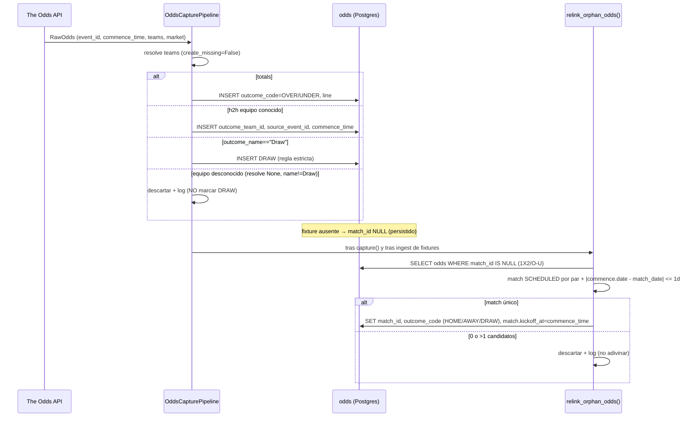

# Design: Fix de críticos de auditoría pre-Mundial

## Technical Approach

Secuencia única, dependiente: **git → backup → ola Alembic → fixes TDD → backfill `kind` → recompute Elo**.
Schema vía Alembic (revisiones separadas por restricción transaccional de PG); datos (dedup, backfill, recompute) vía scripts Python idempotentes corridos con `docker compose run`. La lógica de clasificación es PURA y compartida por ingesta y backfill (una sola implementación). Todo respeta el invariante "determinista separado": clasificación y K-factor no tocan LLM.

## Architecture Decisions

### D1 — Clave de identidad de match: `(match_date, home_team_id, away_team_id)` (sin `competition_id`)
| Opción | Tradeoff | Decisión |
|---|---|---|
| `(date, home, away)` | Una selección juega 1 partido/día → colisión imposible; **ya es la clave que usan goal/shootout linker** (`_match_index`, líneas 116/143/187) | **ELEGIDA** |
| + `competition_id` | Una reclasificación de `kind` duplicaría el mismo partido bajo 2 competiciones → doble conteo Elo | Rechazada |
**Rationale**: la constraint debe coincidir con el supuesto de identidad que el código ya asume; incluir competition_id reintroduce el bug que arreglamos.

### D2 — Enum `OTHER` en migración propia con `autocommit_block`
PG no puede USAR un valor de enum recién agregado en la misma transacción. Migración **M1** aislada: `with op.get_context().autocommit_block(): op.execute("ALTER TYPE competition_kind ADD VALUE IF NOT EXISTS 'other'")`. Idempotente (`IF NOT EXISTS`). Debe commitear antes de cualquier backfill que escriba `'other'`. Rechazado: meterlo con el resto del DDL (falla en PG).

### D3 — CHECK de `odds`: mutuamente excluyente, NO XOR
F3 exige persistir odds de partido SIN fixture (`match_id` NULL **y** `competition_id` NULL = pendiente). XOR estricto las rechazaría. CHECK `ck_odds_target`: `match_id IS NULL OR competition_id IS NULL` (nunca ambos). Estados válidos: outright (`competition_id` set), partido-linkeado (`match_id` set), partido-pendiente (ambos NULL). `match_id` queda nullable.

### D4 — Clasificador puro compartido (`app/ingestion/classification.py`)
`classify_competition_kind(name) -> CompetitionKind` + `CONTINENTAL_CHAMPIONSHIPS` (frozenset). Orden (mantiene precedencia actual): `qualification/qualifier`→QUALIFIER · `nations league`→NATIONS_LEAGUE · **`name == "FIFA World Cup"` exacto**→WORLD_CUP (excluye "Viva World Cup", "CONIFA World Football Cup", "World Unity Cup", "FIFI Wild Cup") · `friendly`→FRIENDLY · `name in CONTINENTAL_CHAMPIONSHIPS`→CONTINENTAL · else→**OTHER** (K=30, hoy ~10k partidos mal clasificados).
Whitelist (nombres reales del dataset): `UEFA Euro`, `Copa América`, `African Cup of Nations`, `AFC Asian Cup`, `Gold Cup`, `CONCACAF Championship`, `Oceania Nations Cup`, `Confederations Cup`. `pipeline.infer_competition_kind` y el backfill **importan esta función** — sin whitelist duplicada. `_NAME_OVERRIDES`→team_alias queda fuera (future).

### D5 — Upsert real (F2): `ON CONFLICT DO UPDATE` sobre `uq_match_identity`
`postgresql.insert(...).on_conflict_do_update(index_elements=[match_date, home_team_id, away_team_id])`, en lotes de 1000. **Actualiza**: home_score, away_score, status, neutral_site, went_to_extra_time/penalties, city, country, stage → habilita transición SCHEDULED→FINISHED durante el torneo. **Preserva**: `id` (intacto → FKs de goal_event/shootout/odds/prediction sobreviven) y `competition_id`. Reemplaza `--force`: re-ingesta siempre idempotente. (Goals/shootouts siguen INSERT; idempotencia de goles = open question, no la flaggeó la auditoría.)

### D6 — ModelVersion inmutable; recompute al final
Hoy `_record_version` upsertea `elo-v1` (destruye params). Nuevo: comparar `params_json` con la última versión; si difiere → INSERT `elo-v{N+1}`; si igual → reusar (recompute idempotente no spamea). EloRating sigue destructivo (tabla "rating actual", sin consumidor aún). Predictions futuras quedan atribuibles a su versión (honestidad de calibración). Recompute es el **último** paso (tras backfill de `kind`, con K correcto).

### D7 — Dedup como prerequisito de cada UNIQUE (matches y `lower(team.name)`)
Pre-flight en script: detectar grupos duplicados; conservar `MIN(id)`, re-apuntar FKs hijas a ese id, borrar perdedores, **luego** crear constraint. Mismo patrón para teams case-duplicados antes del índice funcional `lower(name)`. Resolver pasa a `WHERE lower(Team.name) == lower(:norm)`.

### D8 — Redacción de apiKey
The Odds API solo acepta `apiKey` por query → `raise_for_status()` filtra la key en `HTTPStatusError.request.url`. Helper `_raise_for_status_redacted(resp)`: en error, `raise RuntimeError(f"Odds API {status} {url_con_apiKey_enmascarada}")`. Aplica a `list_sports` y `fetch_odds`.

## Data Flow — captura → persistencia → re-linkeo (F3/F4)

## File Changes
| File | Action | Description |
|---|---|---|
| `app/ingestion/classification.py` | Create | clasificador puro + whitelist (D4) |
| `app/models/enums.py` | Modify | `CompetitionKind.OTHER` |
| `app/models/{odds,match,model}.py` | Modify | `source_event_id`, `commence_time`, `kickoff_at`, `Prediction.line` |
| `app/ingestion/pipeline.py` | Modify | importa clasificador; `_load_matches` → upsert (D5) |
| `app/ingestion/odds_pipeline.py` | Modify | persistir siempre; DRAW estricto; `relink_orphan_odds` (D3/F4) |
| `app/ingestion/sources/odds_api.py` | Modify | redacción apiKey (D8) |
| `app/ingestion/resolver.py` | Modify | `lower(name)` case-insensitive (D7) |
| `app/model/elo_engine.py` | Modify | ModelVersion inmutable (D6) |
| `migrations/versions/` | Create | M1 enum (autocommit), M2 columnas, M3 dedup+UNIQUE+CHECK+índice funcional |
| `scripts/backfill_kind.py`, `scripts/dedup.py` | Create | datos idempotentes |
| `scripts/backup.sh`, `.gitignore` | Create/Modify | pg_dump+gzip; ignore `backups/` |
| `docker-compose.yml` | Modify | `restart: unless-stopped` (db/api); `127.0.0.1:` binds |
| `Dockerfile` | Modify | `COPY uv.lock`; `uv sync --frozen` |
| `README.md` | Modify | warning `down -v`; nota `caffeinate` |

## Testing Strategy
| Layer | What | Approach |
|---|---|---|
| Unit (puro) | clasificador (CONIFA fuera, qualifier precede, OTHER fallback), DRAW estricto, outcome_code, ventana ±1d, redacción URL, `k_factor(OTHER)==30` | pytest, RED→GREEN |
| Integration (DB) | upsert idempotente (2x→1 fila, SCHEDULED→FINISHED), odds persiste con `match_id` NULL, re-link linkea, dedup+constraints, backfill cuenta `kind` antes/después | `docker compose run --rm api pytest` |
| Migration smoke | `alembic upgrade head` + `downgrade -1` por revisión | integración |

## Migration / Rollout
git init + commit "estado pre-fix" (cada fix = diff visible/revertible) → `backup.sh` → M1 → M2 → `dedup.py` → M3 → fixes TDD → `backfill_kind.py` (snapshot distribución antes/después) → `EloEngine.compute()`. Rollback: `alembic downgrade -1` por revisión + restore `pg_dump`; código vía `git revert`.

## Open Questions
- [ ] Idempotencia de goal_event/shootout en `--force` (auditoría no lo flaggeó; ¿out of scope?).
- [ ] Mover `_NAME_OVERRIDES` a `team_alias` (diferido a change futuro).
