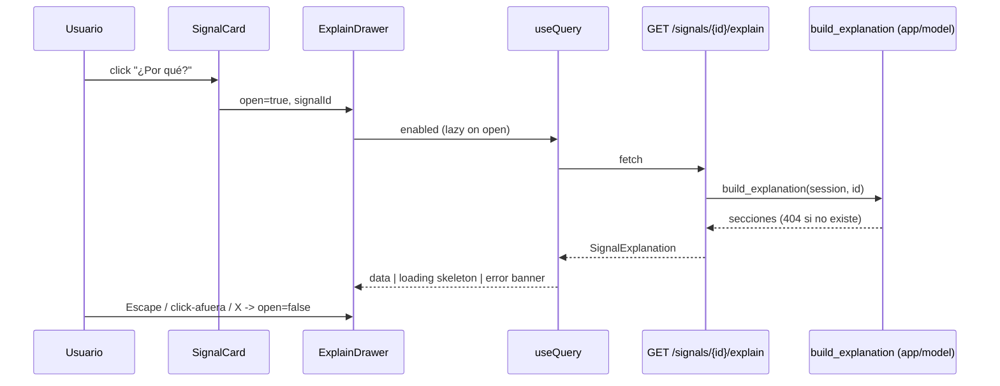

# Design: Dashboard UX explicable — señales como tarjetas + panel de explicación trazable

## Technical Approach

Aditivo. Backend: ensamblador determinista `app/model/explain.py::build_explanation(session, signal_id)` que lee `value_signal → prediction → odds(odds_id) → model_version.params_json → elo_rating` y devuelve dataclasses puras de secciones/pasos. El router `signals.py` agrega `GET /signals/{id}/explain` (thin, mapea dataclasses → `SignalExplanation` Pydantic, 404 si no existe). Front: `SignalCard` + `SignalCardGroup` reemplazan la tabla, `ExplainDrawer` lazy-fetch al abrir, `lib/glossary.ts` + `<GlossaryTerm/>` expandible. Cumple specs `api-readonly` (serve-from-DB), `value-signals` (reconciliación) y `dashboard-frontend` (R2/R2A).

## Hallazgo clave (verificado en código)

`odds_api.py:75` calcula `captured_at` **una vez por corrida** y lo comparte entre TODOS los bookmakers/outcomes → `captured_at` ES clave de snapshot fiable. Pero `best_odds_per_outcome` toma `max(odds)` por outcome sobre TODO el histórico y **mezcla casas** → el `fair_p` persistido NO es el de-vig de una sola casa. Esto fuerza las decisiones 1 y 3.

## Architecture Decisions

| Decisión | Elección | Rechazado | Rationale |
|---|---|---|---|
| Ubicación ensamblador | `app/model/explain.py` (dataclasses puras) | Lógica en el router | Dirección api→model; router thin; testeable sin Pydantic/HTTP |
| Reuso `_lookup_rating` | Extraer a `app/model/ratings.py` (`lookup_rating`, `DEFAULT_RATING`, `HOME_ADVANTAGE`); `predict_1x2` la importa | Duplicar en explain | Evita drift: predict y explain comparten el MISMO lookup point-in-time |
| Triple de-vig ilustrado | Reconstruir best-per-outcome **fijado a `captured_at` del odds_id** (mismo método que el signal, mismo run) | Triple de una sola casa | La casa única NO reconcilia (el edge salió del triple mixto); fijar al run reproduce el cómputo real |
| Números canónicos | Server manda `raw`, `formatted=null` → front formatea con formatters.ts ya testeados (edge, p_model, p_fair, stake, ev, odds) | Server formatea todo | Single source of truth; evita drift; card y drawer muestran el MISMO número |
| Intermedios ilustrativos | Server manda `formatted` string (1/odds, overround, elo_diff, brier, baselines, bookmaker, captured_at) | Front los calcula/formatea | Front JAMÁS hace aritmética; no existe formatter para estos |
| p_fair | SIEMPRE derivado `p_model − edge` | Recomputar devig | Reconcilia exacto con columnas persistidas (criterio de éxito) |
| Drawer a11y | Library-free: `fixed inset-0 z-50`, `role=dialog aria-modal`, autofocus close (ref+effect), Escape (keydown effect), click-outside (backdrop onClick) | Portal + lib focus-trap | Minimal, suficiente, cero deps |
| Glosario | `<details>`-style expandible (botón toggle disclosure) | Tooltip hover | Hover no funciona en touch/mobile |

## Data Flow

    SignalCard [¿Por qué?] ──click──▶ ExplainDrawer(open=true, signalId)
         useQuery(['explain', id], enabled=open) ──▶ GET /signals/{id}/explain
              router ──▶ build_explanation(session, id)
                   value_signal ─ prediction ─ odds(odds_id) ─ model_version ─ elo_rating
              ◀── ExplainSection[] (raw + formatted) ──▶ render (formatters.ts | formatted)



## File Changes

| File | Action | Description |
|---|---|---|
| `app/model/explain.py` | Create | `build_explanation` + dataclasses `ExplainStep/Section/Explanation`; reconstrucción de-vig point-in-time + reconciliación |
| `app/model/ratings.py` | Create | `lookup_rating`, `DEFAULT_RATING`, `HOME_ADVANTAGE` (extraídos de predict_1x2) |
| `app/model/predict_1x2.py` | Modify | importa de `ratings.py`; elimina `_lookup_rating` local |
| `app/api/routers/signals.py` | Modify | `+ GET /signals/{id}/explain` (404) |
| `app/api/schemas.py` | Modify | `ExplainStep`, `ExplainSection`, `SignalExplanation` |
| `frontend/src/components/SignalCard.tsx` | Create | tarjeta lenguaje hincha + botón ¿Por qué? |
| `frontend/src/components/SignalCardGroup.tsx` | Create | agrupa (groupSignals) + hint exposición correlacionada |
| `frontend/src/components/ExplainDrawer.tsx` | Create | drawer reusable (a11y, lazy useQuery, skeleton/error internos) |
| `frontend/src/components/GlossaryTerm.tsx` | Create | término expandible |
| `frontend/src/lib/glossary.ts` | Create | `Record<term,{titulo,explicacion}>` |
| `frontend/src/api/types.ts` | Modify | `SignalExplanation`, `ExplainSection`, `ExplainStep` |
| `frontend/src/pages/SignalsPage.tsx` | Modify | cards + drawer; conserva filtro min_edge |
| `frontend/src/components/SignalsTable.tsx` | Delete | reemplazado por cards |
| `frontend/src/components/SignalsTable.test.tsx` | Delete | obsoleto |
| `frontend/src/lib/groupSignals.ts` | Keep | reusado por SignalCardGroup |

## Interfaces / Contracts

```python
@dataclass
class ExplainStep:
    key: str; label_es: str
    raw: float | str | bool | None
    formatted: str | None            # null → front formatea raw (canónicos); str → render verbatim
    glossary_term: str | None = None

@dataclass
class ExplainSection:
    key: str                          # edge | p_model | stake | calidad | metadata
    titulo: str
    steps: list[ExplainStep]
    note: str | None = None           # caveat ilustrativo / "no reconstruible"
```

Secciones: **edge** (1/odds, overround, p_fair derivado), **p_model** (elo H/A point-in-time, advantage, elo_diff, neutral, low_confidence), **stake** (p_model, odds, ¼-kelly, bankroll → recommended_stake), **calidad** (brier/logloss/baselines/beats_baselines), **metadata** (bookmaker, odds, captured_at, modelo+versión).

**Reconciliación / edge case**: `p_fair = p_model − edge` SIEMPRE. Intermedios de-vig etiquetados *ilustrativos*. Si el triple en ese `captured_at` está incompleto (falta una pata) → sección con `note="no reconstruible desde el snapshot; se muestra prob. justa derivada"`, NO falla el endpoint. Tolerancia: si `|devig_reconstruido − p_fair_derivado| > 1e-3` → `note` aclara que el mejor precio combinó casas/snapshots distintos.

## Testing Strategy

| Layer | What | Approach |
|---|---|---|
| Unit (pytest) | `build_explanation` | Propiedad: cada `raw` canónico == columna persistida verbatim; `p_fair == p_model − edge`; escenario numérico real (signal sembrado); fixture sintético triple incompleto → `note` |
| Unit (pytest) | `lookup_rating` extraído | predict_1x2 sigue verde tras extracción |
| Integration (pytest) | router | 200 con secciones; 404 id inexistente |
| Unit (vitest) | SignalCard, SignalCardGroup, GlossaryTerm | render scenarios, hint correlacionado, expand/collapse |
| Unit (vitest) | ExplainDrawer | open/close/escape/click-afuera, loading skeleton, error banner |
| Integration (vitest) | SignalsPage | cards + drawer con explain mockeado |

Strict TDD: test rojo → verde por unidad. Docker-only (`docker compose run` para pytest/vitest). Labels en español de hincha.

## Migration / Rollout

No migration. Sin cambios de BD. Único borrado destructivo: `SignalsTable(.test).tsx`. Rollback = `git revert`; endpoint read-only sin side-effects.

## Open Questions

- Ninguna que bloquee. (Tolerancia 1e-3 y bankroll desde `params_json.thresholds.bankroll` default 1000 confirmados en código.)
