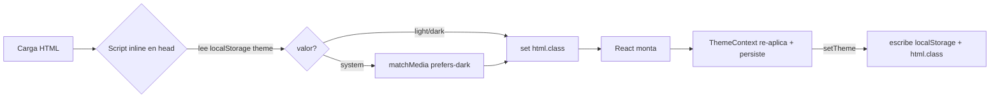
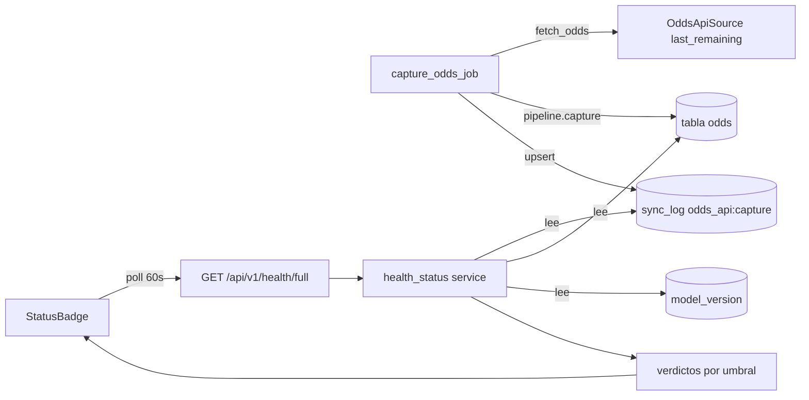

# Design: Centro de Control — rediseño UX/UI + observabilidad

## Technical Approach
Dos capas independientes y aditivas. **Frontend**: design-system (tokens CSS light/dark +
Tailwind `darkMode:'class'`), primitivas en `src/ui/`, AppShell con nav responsive, tema sin
flash, banderas, reflow de tabla de grupos. Migración puramente **presentacional**: ningún hook
de datos, formatter ni contrato de API cambia. **Backend**: 1 endpoint aditivo
`GET /api/v1/health/full` (serve-from-DB), servicio `health_status` con verdictos por umbral,
migración `m8` aditiva en `sync_log` (2 columnas nullable), y la captura de odds que escribe su
fila de auditoría. Invariantes intactas (ver abajo).

## Invariantes (NO romper)
- Front **nunca** hace aritmética — solo formatea números del servidor (formatters intactos).
- Todo **serve-from-DB**: `/health/full` lee Postgres, cero llamadas externas en el request.
- Determinista separado del LLM; sin marcas FIFA (solo banderas emoji + wordmark "WC26").
- Docker-only (tests y build en contenedor). UI en español. Strict TDD.

## Architecture Decisions

### D1 — Tema sin flash
| Opción | Tradeoff | Decisión |
|---|---|---|
| Script inline en `index.html` antes de React | +12 líneas en HTML; cero flash | **ELEGIDA** |
| `useEffect` en root | Flash de tema incorrecto en cada load | Rechazada |
| SSR/cookies | No hay SSR (SPA Vite + nginx) | Rechazada |

El script lee `localStorage['theme']` (`light|dark|system`) y, si `system`, `matchMedia` →
setea `<html class="dark">` **antes** de montar React. `ThemeContext` re-aplica en runtime y
persiste. **Rationale**: el flash es inevitable si la clase se decide tras hidratar; resolverla
en `<head>` es la única vía sin servidor.

### D2 — Tokens CSS → Tailwind semántico
CSS variables en `index.css` (`:root` + `.dark`), consumidas por `tailwind.config` vía
`colors: { bg: 'var(--bg)', ... }`. Set exacto de tokens:

| Token | Rol |
|---|---|
| `--bg`, `--bg-elevated` | fondo app / superficie de Card |
| `--fg`, `--fg-muted` | texto primario / secundario |
| `--border` | bordes |
| `--primary`, `--primary-fg` | acción/marca |
| `--success`, `--warn`, `--danger` | verdictos 🟢🟡🔴 y P&L |
| `--qualify` | zona de clasificación (top 2 standings) |

**Alternativa rechazada**: clases `dark:` dispersas por componente → inmantenible y duplica la
paleta. Tokens centralizan el theming en un punto.

### D3 — Primitivas (`src/ui/`)
| Primitiva | Props mínimas | Reemplaza |
|---|---|---|
| `Card` | `title?, footer?, children` | divs `rounded border bg-white` ad-hoc |
| `Badge` | `variant: 'neutral\|success\|warn\|danger', children` | spans de color |
| `StatusBadge` | (sin props; poolea `/health/full`) | — nuevo |
| `Stat` | `label, value, hint?, tone?` | bloques de PaperStats |
| `Button` | `variant, size, loading?, ...btn` | botones sueltos |
| `Tabs` | `tabs: {id,label}[], value, onChange` | navegación interna |
| `Sheet` | `open, onClose, side, title, children` | base de Cupón/Explain Drawer |
| `FlagLabel` | `team: string, size?` | render nombre + bandera |
| `ThemeToggle` | (consume ThemeContext) | — nuevo |
| `AppShell` | `children` | header/main de App.tsx |
| `Spinner`/`Loading` | — | `Loading.tsx` → `ui/` |
| `ErrorState` | `onRetry?` | `ErrorBanner.tsx` → `ui/` |

**Consolidación**: `ErrorBanner`+`Loading` se mueven a `ui/` como `ErrorState`/`Spinner`.
`CuponDrawer` y `ExplainDrawer` **conservan su lógica** pero envuelven su chrome en `<Sheet>`
(no se reescribe el estado del cupón). **Rationale**: 12 primitivas cubren las 5 vistas + 2
drawers sin tocar lógica de negocio; el riesgo se acota a markup.

### D4 — Nav responsive (un solo route-config)
`AppShell` deriva top-nav (`≥md`) y bottom-tab-bar (`<md`) del **mismo** array de rutas.
`StatusBadge` en el header en ambos breakpoints. La FAB del cupón vive sobre la bottom-bar
(`bottom-16 z-40`, bar en `z-30`) para que no se solapen en teléfono.
**Rechazado**: dos componentes de nav independientes → duplica la verdad de rutas.

### D5 — Reflow de tabla de grupos (el fix nombrado)
| Opción | Tradeoff | Decisión |
|---|---|---|
| Columnas ocultas vía `hidden md:table-cell` + fila expandible con estado JS | Cero overflow-x; expand tap-to-reveal; server sigue siendo autoridad | **ELEGIDA** |
| `overflow-x-auto` (actual) | Scroll lateral en teléfono — lo que arreglamos | Rechazada |
| Render condicional por `useMediaQuery` | Duplica JSX, hidratación inconsistente | Rechazada |

Móvil muestra `Pos · FlagLabel(Equipo) · PJ · DG · Pts`; tap en la fila revela `G/E/P/GF/GC`
(estado local `expandedRow`). `≥md` muestra la tabla completa con todas las columnas vía
`md:table-cell`. Zona de clasificación (índice 0-1) coloreada con `--qualify`. **El servidor
sigue siendo la autoridad del orden** — el cliente nunca re-ordena (`compute_standings` ya manda
las filas ordenadas).

### D6 — `lib/flags.ts`
Mapa `name→ISO2` para las **48** selecciones canónicas del bracket 2026 (query a `group_team`).
Emoji por codepoints de regional-indicator desde ISO-3166 alpha-2. **Overrides**: England
(`🏴󠁧󠁢󠁥󠁮󠁧󠁿`) y Scotland (`🏴󠁧󠁢󠁳󠁣󠁴󠁿`) usan secuencias tag (no existen como ISO2). Desconocido → `🏳`.
Función pura, testeada. **Rationale**: regional-indicator es estándar y sin assets; las
subdivisiones del Reino Unido requieren override explícito.

### D7 — `health/full` y persistencia de captura
Router nuevo `app/api/routers/health_full.py` montado bajo `/api/v1` (NO toca el `/health`
existente de liveness). Servicio `app/model/health_status.py` (pure-ish) lee:

| Métrica | Fuente | Verdicto (umbral const) |
|---|---|---|
| Última captura odds | `sync_log` `resource='odds_api:capture'` `.last_fetched_at` | ok <6h · warn <24h · stale ≥24h |
| Antigüedad de odds | `max(odds.captured_at)` | igual que arriba |
| Créditos restantes | `sync_log.credits_remaining` | ok >50 · warn >10 · stale ≤10 |
| Model version activo | `ModelVersion order by id desc` `.name` | ok si existe · stale si none |
| Último FINISHED | `max(match.match_date) where status=FINISHED` | informativo (ok) |

Cada métrica → `{value, verdict, threshold}`. Verdicto global = peor de los individuales.

**Decisión clave — upsert vs history en SyncLog**: la captura **mantiene el upsert por
`(resource, source)`** para `'odds_api:capture'`; la fila refleja siempre la **última** captura.
El histórico de capturas NO va en `sync_log` — vive en la tabla `odds` vía `captured_at`. Por
eso `UniqueConstraint(resource, source)` se conserva. **Rechazado**: un resource distinto por
run (`odds_api:capture:<ts>`) explotaría la tabla y rompería el patrón de control de ingesta.

**Quién escribe la fila**: `capture_odds_job` en `jobs.py`, NO el pipeline. El job es quien tiene
`source.last_remaining` (créditos) tras `fetch_odds`, y el pipeline ya commitea sus odds. El job
abre/usa la sesión para upsert de la fila `sync_log(resource='odds_api:capture',
source=ODDS_API, last_fetched_at=now, rows_inserted=result['inserted'],
credits_remaining=int(last_remaining), status='ok')`. **Rationale**: respeta la frontera de
transacción del pipeline (lección del bug 2026-06-10: el commit vive donde se conocen todos los
datos) y mantiene `last_remaining` en su único poseedor.

### D8 — Migración m8
`m8_sync_log_capture_fields.py`, `down_revision='m7parlay'` (head actual). Aditiva: agrega
`rows_inserted Integer nullable` y `credits_remaining Integer nullable`. `UniqueConstraint`
intacto. `downgrade` dropea ambas columnas. Sin backfill. **Reversible y segura en prod**.

## Data Flow

### Tema (sin flash)


### Health poll


## File Changes
| File | Action | Description |
|---|---|---|
| `frontend/index.html` | Modify | script inline anti-flash de tema |
| `frontend/tailwind.config.js` | Modify | `darkMode:'class'` + colores semánticos→`var(--*)` |
| `frontend/src/index.css` | Modify | tokens CSS `:root` + `.dark` |
| `frontend/src/context/ThemeContext.tsx` | Create | resolved theme, `setTheme`, persistencia |
| `frontend/src/lib/flags.ts` | Create | name→ISO2→emoji, 48 selecciones, overrides UK |
| `frontend/src/ui/*.tsx` | Create | 12 primitivas + AppShell + StatusBadge |
| `frontend/src/App.tsx` | Modify | usa AppShell + ThemeProvider; rutas + `/estado` |
| `frontend/src/components/GroupCard.tsx` | Modify | reflow condensado/expandible, sin overflow-x |
| `frontend/src/pages/*` | Modify | 5 vistas re-estiladas con primitivas + `EstadoPage` (new) |
| `frontend/src/components/{Cupon,Explain}Drawer.tsx` | Modify | chrome vía `<Sheet>`, lógica intacta |
| `frontend/src/components/{ErrorBanner,Loading}.tsx` | Delete | → `ui/ErrorState`, `ui/Spinner` |
| `frontend/src/api/client.ts` (+ tipos) | Modify | `getHealthFull()` + tipo `HealthFull` |
| `app/api/routers/health_full.py` | Create | `GET /api/v1/health/full` |
| `app/model/health_status.py` | Create | servicio verdictos + umbrales (constantes) |
| `app/main.py` | Modify | `include_router(health_full, prefix='/api/v1')` |
| `app/models/sync.py` | Modify | `rows_inserted`, `credits_remaining` nullable |
| `app/scheduler/jobs.py` | Modify | upsert fila `odds_api:capture` tras captura |
| `migrations/versions/m8_sync_log_capture_fields.py` | Create | columnas aditivas, reversible |

## Interfaces / Contracts
```ts
type Verdict = 'ok' | 'warn' | 'stale'
interface HealthMetric { value: string | number | null; verdict: Verdict; threshold: string }
interface HealthFull {
  overall: Verdict
  last_odds_capture: HealthMetric
  odds_age: HealthMetric
  credits_remaining: HealthMetric
  model_version: HealthMetric
  last_finished: HealthMetric
}
type ThemePref = 'light' | 'dark' | 'system'
```

## Testing Strategy
| Layer | Qué | Cómo |
|---|---|---|
| Unit (FE) | `flags` (48 + override UK + fallback), `ThemeContext` (resolución, persistencia, system) | Vitest puros; `formatters`/`CuponContext` **sin cambios** |
| Unit (FE) | primitivas (`Card/Badge/Stat/Button/Tabs/Sheet/StatusBadge/FlagLabel`) | render + props |
| Component (FE) | `GroupCard` reflow (columnas ocultas, expand tap, zona qualify) | RTL: assert clases responsive + estado expand |
| Migración tests | ~160 tests rompen por markup | conservar lógica/data; **reescribir solo selectores de render** a la nueva estructura; escenarios numéricos preservados |
| Unit (BE) | `health_status` verdictos por umbral (ok/warn/stale, peor-de) | datos sintéticos en sesión |
| Integration (BE) | `GET /api/v1/health/full` 200 + shape | TestClient + DB |
| Integration (BE) | captura escribe/actualiza fila `sync_log` con `rows_inserted`+`credits_remaining` | job con source fake → assert upsert |

**Strict TDD**: test rojo → impl → verde, por primitiva y por métrica. Todo en Docker.

## Migration / Rollout
m8 aditiva (columnas nullable, sin backfill, downgrade dropea). Redesign presentacional:
contratos de API y formatters intactos → sin migración de datos. nginx ya tiene resolver
(fix 2026-06-11). Deploy = rebuild de `api` + `frontend`. Rollback = `git revert` + `alembic downgrade -1`.

## Open Questions
- [ ] Intervalo de poll del StatusBadge: propuesto 60s (alinea con staleTime 30s de React Query). Confirmar.
- [ ] ¿`EstadoPage` muestra las 5 métricas con su threshold textual o solo el verdicto global + detalle on-tap? Propuesto: tarjetas `Stat` por métrica.
