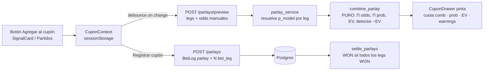

# Design: Cupón de Bloques (Parlay +EV estilo BetPlay)

## Technical Approach

Núcleo determinista primero: `app/model/parlay.py` puro (mismo patrón que
`probabilities.py`), reusando `compute_ev`. Un servicio `parlay_service.py` resuelve
los `p_model` por leg desde la BD y llama al núcleo; los routers quedan finos. La
persistencia agrupa N legs (`bet_leg`) bajo un `BetLog` parlay (stake total, cuota
combinada). El front NUNCA calcula: `POST /parlays/preview` computa todo server-side.
Kambi entra como `OddsSource` flag-gated, fuera del daily loop. Extiende specs
`bet-settlement`, `real-bets`, `dashboard-frontend`.

## Architecture Decisions

| # | Decisión | Elegido | Rechazado | Rationale |
|---|----------|---------|-----------|-----------|
| 1 | CHECK con parlays | Columna `bet_kind` enum SINGLE\|PARLAY + relajar `ck_bet_resolvable` a `bet_kind='parlay' OR (resolvable existente)` | Drop CHECK + validar en app | Un parlay no tiene match/outcome ni signal → no satisface ninguna rama; legs viven en otra tabla, no referenciables en row-CHECK. `bet_kind` explícito, consultable y mantiene la garantía declarativa de integridad |
| 2 | Tipos en `parlay.py` | `Decimal` para odds/dinero, `float` para probs y EV | Todo float / todo Decimal | DB ya usa `Numeric` para odds/pnl y `float` para `probability`; `combined_odds=Π(Decimal)`, `model_prob=Π(float)` (independencia), `ev=compute_ev(prob, float(combined))`. Consistente con `probabilities.py` |
| 3 | Resolver `p_model` por leg | `parlay_service.py` en `app/model/` (api→model) | Query inline en el router | Router fino; dirección de dependencia correcta (api→model, nunca al revés); testeable sin HTTP |
| 4 | Settle de parlay | Función nueva `settle_parlays()`; path simple INTACTO | Ampliar el query de `settle_bets` | Parlay tiene `match_id`/`value_signal_id` NULL → ya queda fuera del JOIN existente; rama separada = cero regresión en simples |
| 5 | Kambi en scheduler | `make_kambi_source()` separado, gated por `KAMBI_ENABLED` (default false) | Añadir al daily loop | OFF por defecto (429 confirmado desde IP datacenter); enhancement, no dependencia |
| 6 | Estado del cupón (front) | `CuponContext` + `sessionStorage` | `useState` en App / Redux | Sobrevive navegación Señales↔Partidos sin prop-drilling ni dependencia nueva; simple |

## Data Flow



`parlay_service` query del `p_model`: `select Prediction.probability where match_id=L.match_id
AND market_type=MATCH_1X2 AND outcome_code=L.outcome_code AND model_version_id=<activa>`
(misma versión activa que usa el servicio de señales). Sin predicción → leg marcado
`p_model=null` → preview lo reporta sin romper.

## File Changes

| File | Action | Description |
|------|--------|-------------|
| `app/model/parlay.py` | Create | Núcleo puro: `Leg`, `LegDiagnosis`, `ParlayDiagnosis`, `combine_parlay()` |
| `app/model/parlay_service.py` | Create | Resuelve `p_model` por leg desde BD → llama `combine_parlay` |
| `app/model/settle.py` | Modify | Añadir `settle_parlays()`; `settle_bets` sin tocar |
| `app/model/run_settle.py` | Modify | Invocar también `settle_parlays()` |
| `app/models/betting.py` | Modify | `BetLog.bet_kind`; modelo `BetLeg` + relación `legs` |
| `app/models/enums.py` | Modify | `BetKind(SINGLE/PARLAY)`; `DataSource.KAMBI="kambi"` |
| `app/models/types.py` | Modify | `bet_kind_type` (enum PG) |
| `migrations/versions/m7_*.py` | Create | `bet_leg` + `bet_log.bet_kind` + relajar `ck_bet_resolvable`. Revises `m6betlogreal` |
| `app/api/routers/parlays.py` | Create | `POST /parlays/preview`, `POST /parlays`, `GET /parlays` |
| `app/api/schemas.py` | Modify | `ParlayLegInput`, `ParlayPreviewRequest/Response`, `ParlayLegDiag`, `ParlayCreate`, `ParlayItem` |
| `app/main.py` | Modify | Registrar router parlays |
| `app/core/config.py` | Modify | `kambi_enabled=false`, `kambi_operator`, `kambi_base_url` |
| `app/ingestion/sources/kambi.py` | Create | `KambiOddsSource` (milli/1000, `_KAMBI_NAME_OVERRIDES`, `bookmaker="betplay"`) |
| `app/scheduler/jobs.py` | Modify | `make_kambi_source()` gated; NO en el loop |
| `tests/fixtures/kambi_sample.json` | Create | Fixture para test de adapter (nunca live) |
| `frontend/src/context/CuponContext.tsx` | Create | Provider `addLeg/removeLeg/clear`, `sessionStorage` |
| `frontend/src/components/CuponDrawer.tsx` + `CuponLegRow.tsx` | Create | Bet-slip; preview debounced; "Registrar cupón" |
| `frontend/src/components/AddToCuponButton.tsx` | Create | Botón reutilizable |
| `frontend/src/components/SignalCard.tsx`, `pages/MatchesPage.tsx`, `App.tsx` | Modify | Botón + montar drawer/provider |
| `frontend/src/api/parlays.ts` + `api/types.ts` | Create/Modify | Tipos + wrappers `fetchAPI` |

## Interfaces / Contracts

```python
# app/model/parlay.py — PURO, sin BD
@dataclass(frozen=True)
class Leg:
    match_id: int; outcome_code: str; odds: Decimal; p_model: float | None; label: str
@dataclass(frozen=True)
class LegDiagnosis:
    leg: Leg; ev: float | None; is_negative_ev: bool
@dataclass(frozen=True)
class ParlayDiagnosis:
    combined_odds: Decimal; model_prob: float; ev: float
    legs: list[LegDiagnosis]; suggested_without_negatives: list[Leg]

def combine_parlay(legs: list[Leg]) -> ParlayDiagnosis: ...
#  combined_odds = Π odds_i ; model_prob = Π p_i (independencia, documentada)
#  ev = compute_ev(model_prob, float(combined_odds))
#  per-leg ev = compute_ev(p_i, float(odds_i)); is_negative_ev = ev < 0
```

Verificación numérica (test verbatim): odds `1.40×2.75×1.84=7.084`;
prob `0.834×0.491×0.780=0.3194`; EV `+1.2627`. Per-leg +16.8/+35.0/+43.5%.

`settle_parlays`: por cada `BetLog` parlay PENDING, cargar `legs` + match de cada uno.
Si ALGÚN leg LOST → parlay LOST (`pnl=-stake`). Si TODOS WON → WON
(`pnl=stake×(odds−1)`). Algún leg sin jugar → queda PENDING. Idempotente.

## Invariantes respetadas
- **Determinista separado del LLM**: parlay math en código, testeable; LLM nunca toca.
- **Front no aritmética**: `preview` server-side es única fuente; UI solo pinta.
- **api→model**: routers llaman `parlay_service`; nunca al revés.
- **OddsSource provider-agnostic**: Kambi cumple el Protocol; sin tocar pipeline.
- **Sin API externa en request de usuario**: preview consulta solo Postgres.

## Testing Strategy

| Layer | Qué | Cómo |
|-------|-----|------|
| Unit | `combine_parlay` (escenarios numéricos verbatim, detector −EV, leg sin p_model) | pytest puro |
| Unit | `KambiOddsSource` | fixture `kambi_sample.json` + httpx mock; NUNCA live |
| Integration | `/parlays/preview` y `/parlays` (persist BetLog+legs) | TestClient + BD |
| Integration | `settle_parlays`: all-won / one-lost / pending; no-regresión simples | sesión BD |
| Integration | m7 upgrade/downgrade limpio | alembic en BD efímera |
| Frontend | `CuponContext` (add/remove/clear/persist), `CuponDrawer` wiring preview, botones | vitest + RTL |

Estricto TDD (test rojo → verde). Docker-only. UI en español.

## Migration / Rollout

m7 (revises `m6betlogreal`): crea `bet_leg`, añade `bet_log.bet_kind` (default
`single`), relaja `ck_bet_resolvable`. `downgrade` revierte limpio (drop tabla +
columna, restaura CHECK). Aditivo: router y drawer se desactivan quitando
registro/import. `KAMBI_ENABLED` nace `false`.

## Open Questions

- [ ] Confirmar slug operador `betplay` desde browser CO (no bloquea: manual es el core).
- [ ] `model_version` activa: confirmar el selector exacto que ya usa el servicio de señales para reusarlo idéntico en `parlay_service`.
